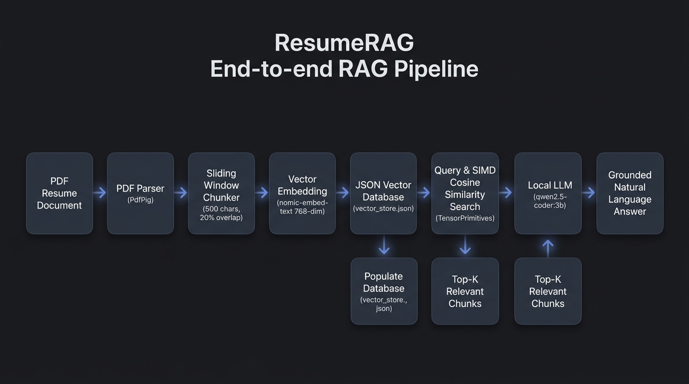
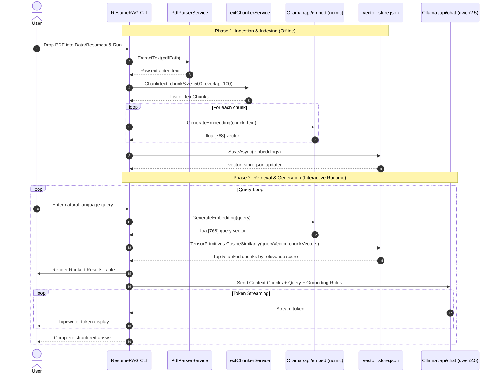

# ResumeRAG

> A fast, 100% local, **Retrieval-Augmented Generation (RAG)** pipeline built with **.NET 10 (C#)** and **Ollama**.

ResumeRAG parses PDF resumes, splits text using a sliding-window chunking strategy with semantic overlap, generates 768-dimensional vector embeddings, performs SIMD-accelerated cosine similarity search, and produces grounded natural-language answers using a local LLM — all rendered in a clean, Apple-inspired terminal interface.

---

## End-to-End Workflow Diagram



### Pipeline Sequence Diagram


### Text Workflow Architecture
```text
+---------------------------------------------------------------------------------------------------+
|                                  PHASE 1: INGESTION & INDEXING                                    |
+---------------------------------------------------------------------------------------------------+
|  [PDF Resume]                                                                                     |
|       │                                                                                           |
|       ▼                                                                                           |
|  [PdfParserService]       Uses PdfPig to extract raw text & normalize whitespace                  |
|       │                                                                                           |
|       ▼                                                                                           |
|  [TextChunkerService]     Sliding window: 500 characters, 100 overlap (20%), 400 stride           |
|       │                                                                                           |
|       ▼                                                                                           |
|  [EmbeddingService]       Ollama REST (/api/embed) -> nomic-embed-text (768-dim float32)          |
|       │                                                                                           |
|       ▼                                                                                           |
|  [VectorStoreService]     Serializes to Data/vector_store.json (incremental merge)                |
+---------------------------------------------------------------------------------------------------+
                                                  │
                                                  ▼
+---------------------------------------------------------------------------------------------------+
|                             PHASE 2: RETRIEVAL & GENERATION (RUNTIME)                             |
+---------------------------------------------------------------------------------------------------+
|  [User Query]             e.g., "What was my CGPA?" or "What are his backend skills?"             |
|       │                                                                                           |
|       ▼                                                                                           |
|  [Query Vectorizer]       Ollama (/api/embed) -> 768-dim query vector                             |
|       │                                                                                           |
|       ▼                                                                                           |
|  [SIMD Search Engine]     System.Numerics.Tensors TensorPrimitives.CosineSimilarity               |
|       │                   Scans vector_store.json in memory (hardware accelerated)                |
|       ▼                                                                                           |
|  [Top-K Rank Filter]      Selects top 5 highest-similarity chunks                                 |
|       │                                                                                           |
|       ├───────────────────> Displays Spectre.Console Ranked Results Table                          |
|       ▼                                                                                           |
|  [RAG Prompt Builder]     Combines Context Chunks + Strict System Grounding Prompt + Question     |
|       │                                                                                           |
|       ▼                                                                                           |
|  [LlmService]             Ollama (/api/chat) -> qwen2.5-coder:3b (Streaming enabled)              |
|       │                                                                                           |
|       ▼                                                                                           |
|  [Live Token Stream]      Real-time typewriter display to console -> Accurate, Grounded Answer   |
+---------------------------------------------------------------------------------------------------+
```

---

## Key Features

- **100% Local & Private:** No cloud APIs, no subscription fees, no telemetry. Your resume data never leaves your computer.
- **Sliding-Window Chunking:** Prevents semantic boundary truncation by maintaining a 20% overlap across chunk strides.
- **Hardware-Accelerated Similarity:** Uses .NET `System.Numerics.Tensors.TensorPrimitives.CosineSimilarity()` for SIMD-vectorized dot product calculation.
- **Streaming Generation:** Token-by-token streaming from local Ollama (`qwen2.5-coder:3b`) with real-time typewriter feedback.
- **Refined Terminal UX:** Apple-inspired executive color palette (slate blue `#5B8DEF`, off-white `#F5F5F7`, neutral grey `#8E8E93`), zero emojis, universal UTF-8 box drawing, and clean tables.
- **Incremental Indexing:** Detects existing embeddings in `vector_store.json` and updates only modified or newly added resumes.

---

## Core Concepts Explained

### 1. Why Chunking?
Raw documents cannot simply be sent as a single monolithic prompt:
- LLMs have finite context windows.
- Retrieval accuracy drops when searching over large documents because embeddings become diluted.
- Splitting text into discrete chunks (e.g., 500 characters) creates focused semantic units (skills, job entries, education history).

### 2. Why Overlap (Stride)?
If a sentence or bullet point falls on a chunk boundary, splitting it strictly at character 500 would cut critical thoughts in half:
```
[Chunk 0: characters 0 to 500]
...creator of CareerCopilot and WhatsAppAutoReplyAssistant. Skilled in Java, Java

[Chunk 1: characters 400 to 900]
...CareerCopilot and WhatsAppAutoReplyAssistant. Skilled in Java, JavaScript, React.js, Next.js...
```
With **100-character overlap** (stride = 400 chars):
- The end of Chunk 0 is repeated at the start of Chunk 1.
- No skill list, metric, or sentence is lost at the seam.

### 3. Vector Embeddings & Cosine Similarity
1. **Embedding Model (`nomic-embed-text`):** Converts text into a 768-dimensional float array (`float[768]`) representing its semantic meaning in high-dimensional vector space.
2. **Cosine Similarity:** Measures the angle between the query vector ($\vec{q}$) and document chunk vector ($\vec{d}$):
   $$\text{similarity} = \cos(\theta) = \frac{\vec{q} \cdot \vec{d}}{\|\vec{q}\| \|\vec{d}\|}$$
   Values close to `1.0` indicate high semantic match. Even if words are misspelled (e.g., `"backebnd"` instead of `"backend"`), vector similarity matches based on conceptual closeness.

### 4. Grounded Generation (The "G" in RAG)
Retrieved top chunks are packaged into a prompt with a strict system constraint:
> *"Answer ONLY based on the provided context. Do not make up information. When citing sources, use the document name and actual chunk number."*

This prevents hallucination and guarantees verifiable answers grounded in candidate resume text.

---

## Prerequisites

1. **.NET 10 SDK** (or .NET 8+)
   - Check with: `dotnet --version`
2. **Ollama** installed and running locally:
   - Download from: [ollama.com](https://ollama.com)
   - Ensure the service is active (`ollama serve`)
3. **Required Ollama Models:**
   ```bash
   ollama pull nomic-embed-text
   ollama pull qwen2.5-coder:3b
   ```

---

## Quick Start

### 1. Clone & Navigate
```bash
cd D:\.NET\src\ResumeRAG
```

### 2. Place Your Resumes
Drop one or more PDF resumes into the resumes directory:
```
D:\.NET\src\ResumeRAG\Data\Resumes\
```
*(e.g., `Sailen_Mondal_Resume.pdf`)*

### 3. Build & Run
```bash
dotnet run
```

---

## Example Usage & Output

### Startup & Pipeline Ingestion
```text
     ____                                            ____       _       ____ 
    |  _ \    ___   ___   _   _   _ __ ___     ___  |  _ \     / \     / ___|
    | |_) |  / _ \ / __| | | | | | '_ ` _ \   / _ \ | |_) |   / _ \   | |  _ 
    |  _ <  |  __/ \__ \ | |_| | | | | | | | |  __/ |  _ <   / ___ \  | |_| |
    |_| \_\  \___| |___/  \__,_| |_| |_| |_|  \___| |_| \_\ /_/   \_\  \____|
                                                                             
              --- Local Retrieval-Augmented Generation Engine ---               


── Stage 0: Pre-flight Checks ──────────────────────────────────────────────────

  [INFO] Checking Ollama server connectivity...
  [OK] Ollama server is reachable.
  [OK] Embedding model 'nomic-embed-text' is available.
  [OK] LLM model 'qwen2.5-coder:3b' is ready for generation.

── Stage 1: PDF Discovery & Parsing ────────────────────────────────────────────

                  Discovered PDF Documents                   
╭──────┬──────────────────────────┬──────────┬──────────────╮
│  #   │ File Name                │  Pages   │         Size │
├──────┼──────────────────────────┼──────────┼──────────────┤
│  1   │ Sailen_Mondal_Resume.pdf │    1     │       624 KB │
╰──────┴──────────────────────────┴──────────┴──────────────╯

  [OK] Sailen_Mondal_Resume.pdf -> 2,942 characters extracted

── Stage 2: Text Chunking (Sliding Window) ─────────────────────────────────────

╭─Chunking Configuration──────────────────╮
│ Strategy:     Fixed-size Sliding Window │
│ Chunk Size:   500 characters            │
│ Overlap:      100 characters (20%)      │
│ Stride:       400 characters            │
╰─────────────────────────────────────────╯

Target Document:    Sailen_Mondal_Resume.pdf
Chunks Generated:   8                       
Chunk Size:         500 characters          
Window Overlap:     100 characters (20%)    
Window Stride:      400 characters          

                          Chunk Preview (first 5 of 8)                          
╭───────┬────────────────┬──────────┬──────────────────────────────────────────╮
│   #   │   Char Range   │  Length  │ Content Preview                          │
├───────┼────────────────┼──────────┼──────────────────────────────────────────┤
│   0   │     0-500      │   500    │ SailenMondalAspiringSoftwareEngineer...  │
│   1   │    400-900     │   500    │ Recruitment’sproducti...                 │
│   2   │    800-1300    │   500    │ droidApps,BackgroundServices...          │
│   3   │   1200-1700    │   500    │ platformforcandidateandrecruiter...      │
│   4   │   1600-2100    │   500    │ AI-assistedjob-application...            │
│  ...  │      ...       │   ...    │ (3 more chunks not shown)                │
╰───────┴────────────────┴──────────┴──────────────────────────────────────────╯

  [OK] Total chunks across all documents: 8

── Stage 3: Embedding Generation (Ollama) ──────────────────────────────────────

  [INFO] Model: nomic-embed-text (768 dimensions)
  [INFO] Generating embeddings for 8 chunks...

── Stage 4: Vector Store Persistence ───────────────────────────────────────────

╭─Vector Store Summary─────────────────────────────────────────────╮
│ Total Chunks:       8                                            │
│ Source Documents:   1                                            │
│ Vector Dimension:   768 (float32)                                │
│ Store File:         D:\.NET\src\ResumeRAG\Data\vector_store.json │
╰──────────────────────────────────────────────────────────────────╯

  [OK] Vector store saved to D:\.NET\src\ResumeRAG\Data\vector_store.json

── Stage 5: Interactive Search ─────────────────────────────────────────────────

  [INFO] Type your query and press Enter. Type 'exit' to quit.
  [INFO] Top 5 results will be shown for each query.
```

### Asking Questions
```text
── Enter Your Query ────────────────────────────────────────────────────────────
> What was my CGPA?

── Search Results: "What was my CGPA?" ─────────────────────────────────────────

╭────────┬───────────┬───────────────────────┬─────────┬───────────────────────╮
│  Rank  │   Score   │ Source                │  Chunk  │ Content               │
├────────┼───────────┼───────────────────────┼─────────┼───────────────────────┤
│   #1   │  0.5702   │ Sailen_Mondal_Resume. │    7    │ GPA:8.62RampurhatHigh │
│        │           │ pdf                   │         │ School2019–2021Higher │
...
╰────────┴───────────┴───────────────────────┴─────────┴───────────────────────╯

── AI-Generated Answer ─────────────────────────────────────────────────────────

My CGPA was 8.62.

────────────────────────────────────────────────────────────────────────────────
```

---

## Project Structure

```
D:\.NET\src\ResumeRAG\
├── Data\
│   ├── Resumes\                 # Drop candidate PDF files here
│   │   └── Sailen_Mondal_Resume.pdf
│   └── vector_store.json        # Persisted vector database (auto-generated)
├── Models\
│   ├── TextChunk.cs             # Text slice with start/end character offsets
│   ├── ChunkEmbedding.cs        # Chunk text + float[768] vector
│   └── SearchResult.cs          # Chunk match + cosine similarity score
├── Services\
│   ├── PdfParserService.cs      # PdfPig extraction + whitespace normalization
│   ├── TextChunkerService.cs    # Sliding-window algorithm (chunk/overlap/stride)
│   ├── EmbeddingService.cs      # Ollama /api/embed client (nomic-embed-text)
│   ├── LlmService.cs            # Ollama /api/chat streaming client (qwen2.5-coder:3b)
│   ├── VectorStoreService.cs    # JSON serialization + TensorPrimitives SIMD search
│   └── ConsoleUIService.cs      # Spectre.Console rendering (Apple-inspired palette)
├── Program.cs                   # 5-stage pipeline orchestrator & interactive loop
├── ResumeRAG.csproj             # .NET 10 project definition
└── README.md                    # Project documentation
```

---

## Configuration & Tuning

You can modify parameters at the top of [`Program.cs`](file:///D:/.NET/src/ResumeRAG/Program.cs):

| Parameter | Default | Purpose |
|---|---|---|
| `ChunkSize` | `500` | Target character length for each text slice. |
| `Overlap` | `100` | Number of trailing characters carried over into the next chunk (20%). |
| `TopK` | `5` | Number of top cosine similarity matches supplied as context to the LLM. |

### Swapping Models
- **Embedding Model:** Change model in [`EmbeddingService.cs`](file:///D:/.NET/src/ResumeRAG/Services/EmbeddingService.cs) constructor (default: `nomic-embed-text`).
- **Generation Model:** Change model in [`LlmService.cs`](file:///D:/.NET/src/ResumeRAG/Services/LlmService.cs) constructor (default: `qwen2.5-coder:3b`; e.g., `llama3.2`, `mistral`, or `phi4`).

---

## Tech Stack & Dependencies

- **Platform:** [.NET 10 (C# 13)](https://dotnet.microsoft.com/)
- **PDF Extraction:** [PdfPig](https://github.com/UglyToad/PdfPig) (`1.7.0-custom-5`)
- **CLI Rendering:** [Spectre.Console](https://spectreconsole.net/) (`0.57.2`)
- **SIMD Tensors:** `System.Numerics.Tensors` (`10.0.12`)
- **Local AI Runtime:** [Ollama](https://ollama.com/) (REST APIs `/api/embed` and `/api/chat`)

---

## License
MIT License. Free to use, modify, and distribute.
